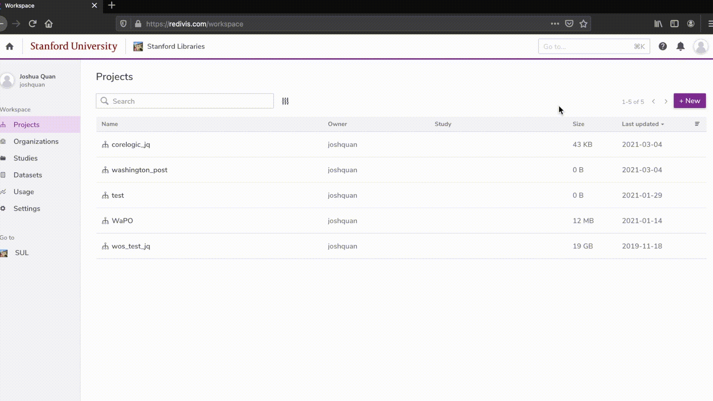

<!-- README.md is generated from README.Rmd. Please edit that file -->

```{r, include = FALSE}
knitr::opts_chunk$set(
  collapse = TRUE,
  comment = "#>",
  fig.path = "man/figures/README-",
  out.width = "100%"
)
```
[](https://travis-ci.org/wrathofquan/sul.wp)

# sul.wp

<!-- badges: start -->
<!-- badges: end -->

The goal of sul.wp is to help Stanford researchers access the Library's collection of Washington Post Full-Text Archives through R

### Installation

``` r
install.packages("devtools")
devtools::install_github("wrathofquan/sul.wp")
```
### Authenticate



```{r}
library(sul.wp)

## Authenticate with Redivis
## More on Redivis API: https://apidocs.redivis.com/authorization

# redivis_auth("your-api-token")
```


### Retrieve Articles by Single Year 

```{r}

## Get an entire year of articles

df_1977 <- get_articles_year("1977")

head(df_1977)

dim(df_1977)

```

### Retrieve Articles by Multiple Years 

```{r}
## To get multiple years of articles, you can use purrr, apply, or a 'for' loop.
## Example using purrr:

years <- c("1977", "1980")

df_twoYears <- purrr::map_dfr(years, get_articles_year) 

dim(df_twoYears)

```


### Search Corpus by Keyword

```{r}
## Search title and paragraphs of articles using case-insensitive keyword, restrict by year, remove <html> formatting from articles
## Note that some articles are assets like embedded videos or image slide-shows
## use of strip_html will likely return empty strings for these types of content. 

df_blm <- search_articles(query = "Black Lives Matter", year = "2016", strip_html = TRUE)

head(df_blm)

```


<!-- What is special about using `README.Rmd` instead of just `README.md`? You can include R chunks like so: -->

<!-- ```{r cars} -->
<!-- summary(cars) -->
<!-- ``` -->

<!-- You'll still need to render `README.Rmd` regularly, to keep `README.md` up-to-date. `devtools::build_readme()` is handy for this. You could also use GitHub Actions to re-render `README.Rmd` every time you push. An example workflow can be found here: <https://github.com/r-lib/actions/tree/master/examples>. -->

<!-- You can also embed plots, for example: -->

<!-- ```{r pressure, echo = FALSE} -->
<!-- plot(pressure) -->
<!-- ``` -->

<!-- In that case, don't forget to commit and push the resulting figure files, so they display on GitHub and CRAN. -->
