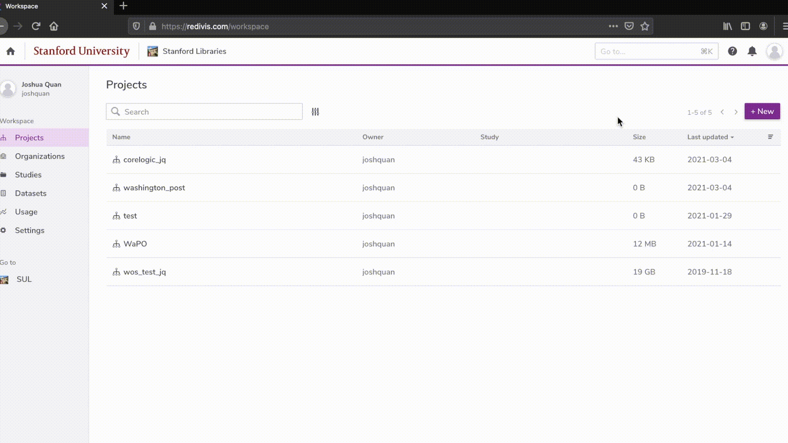

<!-- README.md is generated from README.Rmd. Please edit that file -->

[](https://travis-ci.org/wrathofquan/sul.wp)

# sul.wp

<!-- badges: start -->
<!-- badges: end -->

The goal of sul.wp is to help Stanford researchers access the Library’s
collection of Washington Post Full-Text Archives through R

### Installation

``` r
install.packages("devtools")
devtools::install_github("wrathofquan/sul.wp")
```

### Authenticate

First log in to redivis.com with your SUNet ID. Then create your API
token:



``` r
library(sul.wp)

## Authenticate with Redivis
## More on Redivis API: https://apidocs.redivis.com/authorization

# redivis_auth("your-api-token")
```

### Retrieve Articles by Single Year

``` r
## Get an entire year of articles

df_1977 <- get_articles_year("1977")
#> Running job 'som-phs-redivis-prod.ffa75d9c-5cd8-4d3b-bec8-0ad4e4c8c8fc.US' [-]  1sRunning job 'som-phs-redivis-prod.ffa75d9c-5cd8-4d3b-bec8-0ad4e4c8c8fc.US' [\]  2sRunning job 'som-phs-redivis-prod.ffa75d9c-5cd8-4d3b-bec8-0ad4e4c8c8fc.US' [|]  2sRunning job 'som-phs-redivis-prod.ffa75d9c-5cd8-4d3b-bec8-0ad4e4c8c8fc.US' [/]  2sRunning job 'som-phs-redivis-prod.ffa75d9c-5cd8-4d3b-bec8-0ad4e4c8c8fc.US' [-]  3sRunning job 'som-phs-redivis-prod.ffa75d9c-5cd8-4d3b-bec8-0ad4e4c8c8fc.US' [\]  3sRunning job 'som-phs-redivis-prod.ffa75d9c-5cd8-4d3b-bec8-0ad4e4c8c8fc.US' [|]  4sRunning job 'som-phs-redivis-prod.ffa75d9c-5cd8-4d3b-bec8-0ad4e4c8c8fc.US' [/]  4sRunning job 'som-phs-redivis-prod.ffa75d9c-5cd8-4d3b-bec8-0ad4e4c8c8fc.US' [-]  4sRunning job 'som-phs-redivis-prod.ffa75d9c-5cd8-4d3b-bec8-0ad4e4c8c8fc.US' [\]  5sRunning job 'som-phs-redivis-prod.ffa75d9c-5cd8-4d3b-bec8-0ad4e4c8c8fc.US' [|]  5sRunning job 'som-phs-redivis-prod.ffa75d9c-5cd8-4d3b-bec8-0ad4e4c8c8fc.US' [/]  5sRunning job 'som-phs-redivis-prod.ffa75d9c-5cd8-4d3b-bec8-0ad4e4c8c8fc.US' [-]  6sRunning job 'som-phs-redivis-prod.ffa75d9c-5cd8-4d3b-bec8-0ad4e4c8c8fc.US' [\]  6sRunning job 'som-phs-redivis-prod.ffa75d9c-5cd8-4d3b-bec8-0ad4e4c8c8fc.US' [|]  7sRunning job 'som-phs-redivis-prod.ffa75d9c-5cd8-4d3b-bec8-0ad4e4c8c8fc.US' [/]  7sRunning job 'som-phs-redivis-prod.ffa75d9c-5cd8-4d3b-bec8-0ad4e4c8c8fc.US' [-]  7sRunning job 'som-phs-redivis-prod.ffa75d9c-5cd8-4d3b-bec8-0ad4e4c8c8fc.US' [\]  8sRunning job 'som-phs-redivis-prod.ffa75d9c-5cd8-4d3b-bec8-0ad4e4c8c8fc.US' [|]  8sRunning job 'som-phs-redivis-prod.ffa75d9c-5cd8-4d3b-bec8-0ad4e4c8c8fc.US' [/]  8sRunning job 'som-phs-redivis-prod.ffa75d9c-5cd8-4d3b-bec8-0ad4e4c8c8fc.US' [-]  8s
#> Complete
#> Billed: 137.36 MB
#> Downloading 30,390 rows in 4 pages.
#> Downloading data [======================>---------------------------------------------------------------------]  25% ETA:  4sDownloading data [=============================================>----------------------------------------------]  50% ETA:  3sDownloading data [====================================================================>-----------------------]  75% ETA:  1sDownloading data [============================================================================================] 100% ETA:  0s                                                                                                                             
#> Parsing [===========================-------------------------------------------------------------------------------] ETA:  0sParsing [================================================================================--------------------------] ETA:  0sParsing [==========================================================================================================] ETA:  0s                                                                                                                             

head(df_1977)
#> # A tibble: 6 x 5
#>   publish_date       section authors title                       paragraphs                                                    
#>   <chr>              <chr>   <chr>   <chr>                       <chr>                                                         
#> 1 1977-11-21T00:00:… local   <NA>    "Kilda Harrell, Among Firs… "Kilda Malcolm Harrell, 84, one of the first women to become …
#> 2 1977-06-08T00:00:… local   <NA>    "Chilly Weather to Linger … "Blustery winds and unreasonably cool temperatures swept thro…
#> 3 1977-11-10T00:00:… local   <NA>    "Greening-up a Brownish Av… "Harry Roberts, Washington, D.C., writes., \"My 9-month-old a…
#> 4 1977-11-11T00:00:… local   <NA>    "Edgar Meritt Douglass, Fo… "Edgar Meritt Douglass, 74, a principal at Montgomery Blair H…
#> 5 1977-02-02T00:00:… local   <NA>    "Benjamin Denio, Communica… "Benjamin W. (Ben) Denio, 55, who had served the Navy for mor…
#> 6 1977-07-07T00:00:… local   <NA>    "Commuters get 60 days to … "The U.S. Supreme Court this week granted a group of Arlingto…

dim(df_1977)
#> [1] 30390     5
```

### Retrieve Articles by Multiple Years

``` r
## To get multiple years of articles, you can use purrr, apply, or a 'for' loop.
## Example using purrr:

years <- c("1977", "1980")

df_twoYears <- purrr::map_dfr(years, get_articles_year) 
#> Complete
#> Billed: 0 B
#> Downloading 30,390 rows in 4 pages.
#> Downloading data [======================>---------------------------------------------------------------------] 25% ETA: 4s
#> Downloading data [=============================================>----------------------------------------------] 50% ETA: 4s
#> Downloading data [====================================================================>-----------------------] 75% ETA: 1s
#> Downloading data [============================================================================================] 100% ETA: 0s
#> Parsing [===========================-------------------------------------------------------------------------------] ETA:  0sParsing [==========================================================================================================] ETA:  0s                                                                                                                             
#> Running job 'som-phs-redivis-prod.b931022f-b466-4966-abd6-cbb58867e0cc.US' [-]  1sRunning job 'som-phs-redivis-prod.b931022f-b466-4966-abd6-cbb58867e0cc.US' [\]  2sRunning job 'som-phs-redivis-prod.b931022f-b466-4966-abd6-cbb58867e0cc.US' [|]  2sRunning job 'som-phs-redivis-prod.b931022f-b466-4966-abd6-cbb58867e0cc.US' [/]  2sRunning job 'som-phs-redivis-prod.b931022f-b466-4966-abd6-cbb58867e0cc.US' [-]  3sRunning job 'som-phs-redivis-prod.b931022f-b466-4966-abd6-cbb58867e0cc.US' [\]  3sRunning job 'som-phs-redivis-prod.b931022f-b466-4966-abd6-cbb58867e0cc.US' [|]  4sRunning job 'som-phs-redivis-prod.b931022f-b466-4966-abd6-cbb58867e0cc.US' [/]  4sRunning job 'som-phs-redivis-prod.b931022f-b466-4966-abd6-cbb58867e0cc.US' [-]  4sRunning job 'som-phs-redivis-prod.b931022f-b466-4966-abd6-cbb58867e0cc.US' [\]  4sRunning job 'som-phs-redivis-prod.b931022f-b466-4966-abd6-cbb58867e0cc.US' [|]  5sRunning job 'som-phs-redivis-prod.b931022f-b466-4966-abd6-cbb58867e0cc.US' [/]  5sRunning job 'som-phs-redivis-prod.b931022f-b466-4966-abd6-cbb58867e0cc.US' [-]  6sRunning job 'som-phs-redivis-prod.b931022f-b466-4966-abd6-cbb58867e0cc.US' [\]  6sRunning job 'som-phs-redivis-prod.b931022f-b466-4966-abd6-cbb58867e0cc.US' [|]  6sRunning job 'som-phs-redivis-prod.b931022f-b466-4966-abd6-cbb58867e0cc.US' [/]  7sRunning job 'som-phs-redivis-prod.b931022f-b466-4966-abd6-cbb58867e0cc.US' [-]  7sRunning job 'som-phs-redivis-prod.b931022f-b466-4966-abd6-cbb58867e0cc.US' [\]  7sRunning job 'som-phs-redivis-prod.b931022f-b466-4966-abd6-cbb58867e0cc.US' [|]  8sRunning job 'som-phs-redivis-prod.b931022f-b466-4966-abd6-cbb58867e0cc.US' [/]  8sRunning job 'som-phs-redivis-prod.b931022f-b466-4966-abd6-cbb58867e0cc.US' [-]  8sRunning job 'som-phs-redivis-prod.b931022f-b466-4966-abd6-cbb58867e0cc.US' [\]  9sRunning job 'som-phs-redivis-prod.b931022f-b466-4966-abd6-cbb58867e0cc.US' [|]  9sRunning job 'som-phs-redivis-prod.b931022f-b466-4966-abd6-cbb58867e0cc.US' [/]  9sRunning job 'som-phs-redivis-prod.b931022f-b466-4966-abd6-cbb58867e0cc.US' [-] 10sRunning job 'som-phs-redivis-prod.b931022f-b466-4966-abd6-cbb58867e0cc.US' [\] 10sRunning job 'som-phs-redivis-prod.b931022f-b466-4966-abd6-cbb58867e0cc.US' [|] 10s
#> Complete
#> Billed: 177.21 MB
#> Downloading 36,724 rows in 4 pages.
#> Downloading data [======================>---------------------------------------------------------------------]  25% ETA: 13sDownloading data [=============================================>----------------------------------------------]  50% ETA:  5sDownloading data [====================================================================>-----------------------]  75% ETA:  2sDownloading data [============================================================================================] 100% ETA:  0s                                                                                                                             
#> Parsing [===========================-------------------------------------------------------------------------------] ETA:  0sParsing [==========================================================================================================] ETA:  0s                                                                                                                             

dim(df_twoYears)
#> [1] 67114     5
```

### Search Corpus by Keyword

``` r
## Search title and paragraphs of articles using case-insensitive keyword, restrict by year, remove <html> formatting from articles
## Note that some articles are assets like embedded videos or image slide-shows
## use of strip_html will likely return empty strings for these types of content. 

df_blm <- search_articles(query = "Black Lives Matter", year = "2016", strip_html = TRUE)
#> Running job 'som-phs-redivis-prod.51728554-42ee-44df-9d4d-c504ef52a983.US' [-]  1sRunning job 'som-phs-redivis-prod.51728554-42ee-44df-9d4d-c504ef52a983.US' [\]  2sRunning job 'som-phs-redivis-prod.51728554-42ee-44df-9d4d-c504ef52a983.US' [|]  2sRunning job 'som-phs-redivis-prod.51728554-42ee-44df-9d4d-c504ef52a983.US' [/]  2sRunning job 'som-phs-redivis-prod.51728554-42ee-44df-9d4d-c504ef52a983.US' [-]  3sRunning job 'som-phs-redivis-prod.51728554-42ee-44df-9d4d-c504ef52a983.US' [\]  3sRunning job 'som-phs-redivis-prod.51728554-42ee-44df-9d4d-c504ef52a983.US' [|]  3sRunning job 'som-phs-redivis-prod.51728554-42ee-44df-9d4d-c504ef52a983.US' [/]  4sRunning job 'som-phs-redivis-prod.51728554-42ee-44df-9d4d-c504ef52a983.US' [-]  4sRunning job 'som-phs-redivis-prod.51728554-42ee-44df-9d4d-c504ef52a983.US' [\]  4sRunning job 'som-phs-redivis-prod.51728554-42ee-44df-9d4d-c504ef52a983.US' [|]  5sRunning job 'som-phs-redivis-prod.51728554-42ee-44df-9d4d-c504ef52a983.US' [/]  5sRunning job 'som-phs-redivis-prod.51728554-42ee-44df-9d4d-c504ef52a983.US' [-]  5sRunning job 'som-phs-redivis-prod.51728554-42ee-44df-9d4d-c504ef52a983.US' [\]  5s
#> Complete
#> Billed: 1.93 GB
#> Downloading 2,898 rows in 1 pages.
#> Downloading data [============================================================================================] 100% ETA:  0s                                                                                                                             
#> Parsing [==========================================================================================================] ETA:  0s                                                                                                                             

head(df_blm)
#> # A tibble: 6 x 5
#>   publish_date       section        authors   title                      paragraphs                                            
#>   <chr>              <chr>          <chr>     <chr>                      <chr>                                                 
#> 1 2016-10-14T10:43:… classic-apps   Chris Ri… Rap’s new golden age       Clockwise from top left, 21 Savage, Chance the Rapper…
#> 2 2016-11-21T22:50:… /opinions/pos… Charles … Did furor over police sho… Add this to the many other analytical puzzles regardi…
#> 3 2016-02-11T08:21:… opinions       Kim Gall… Integration and police br… Kim Gallon is an assistant professor of history at Pu…
#> 4 2016-07-26T20:20:… politics       Katie Ze… Nation’s opioid crisis ga… The nation’s epidemic of opioid abuse, which has kill…
#> 5 2016-06-23T13:19:… goingoutguide  Ann Horn… Wrong time for a white Kn… At the height of the Civil War, Newton Knight (Matthe…
#> 6 2016-10-06T16:50:… entertainment  Roger Ca… Troupe still breaks the c… When the Dance Theatre of Harlem makes its annual vis…
```

<!-- What is special about using `README.Rmd` instead of just `README.md`? You can include R chunks like so: -->
<!-- ```{r cars} -->
<!-- summary(cars) -->
<!-- ``` -->
<!-- You'll still need to render `README.Rmd` regularly, to keep `README.md` up-to-date. `devtools::build_readme()` is handy for this. You could also use GitHub Actions to re-render `README.Rmd` every time you push. An example workflow can be found here: <https://github.com/r-lib/actions/tree/master/examples>. -->
<!-- You can also embed plots, for example: -->
<!-- ```{r pressure, echo = FALSE} -->
<!-- plot(pressure) -->
<!-- ``` -->
<!-- In that case, don't forget to commit and push the resulting figure files, so they display on GitHub and CRAN. -->
